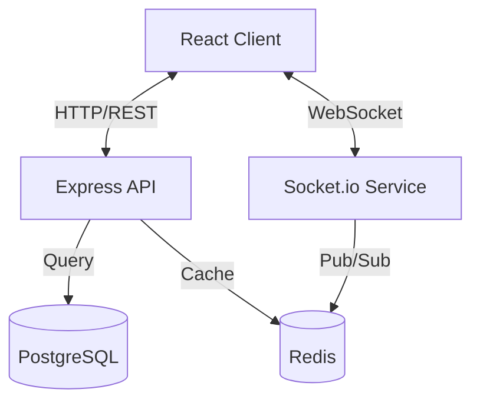
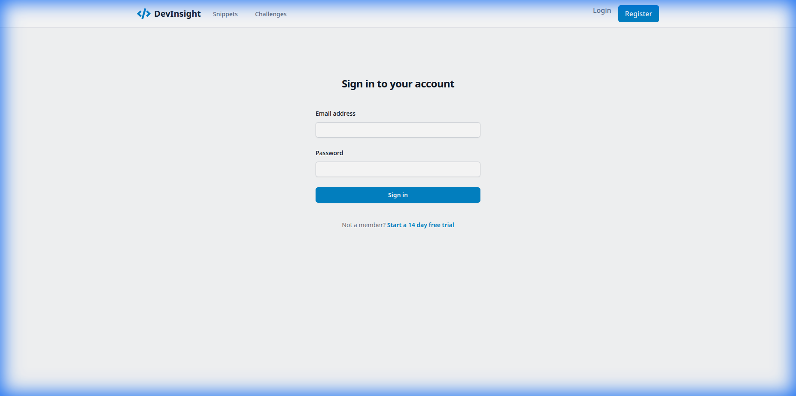
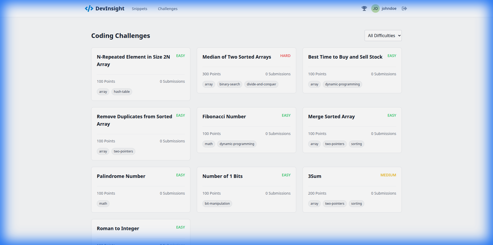
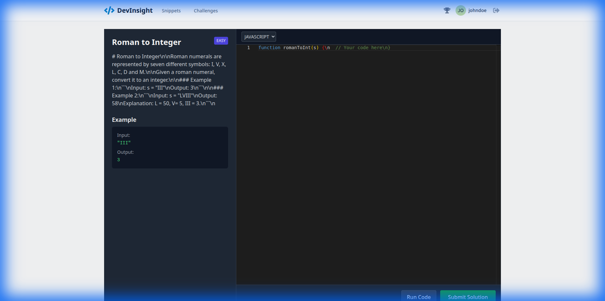

# DevInsight


**DevInsight** is a real-time developer collaboration platform designed to streamline code sharing, pair programming, and skill assessment. It features a modern, responsive interface and robust backend to support seamless developer interactions.

## 🚀 Features

-   **📡 Real-time Collaboration**: Code continuously with other developers using a synchronized editor (Monaco Editor + Socket.io).
-   **🧩 Code Snippets**: Create, manage, and share reusable code snippets with syntax highlighting.
-   **🏆 Coding Challenges**: Participate in algorithmic challenges, run test cases, and track your progress on the leaderboard.
-   **⚡ High Performance**: Built with a scalable architecture using Redis for caching and session management.

## 🛠️ Tech Stack

### Frontend
-   **Framework**: React 18, TypeScript, Create React App
-   **State Management**: Redux Toolkit
-   **Styling**: Tailwind CSS
-   **Editor**: Monaco Editor
-   **Real-time**: Socket.io Client

### Backend
-   **Runtime**: Node.js
-   **Framework**: Express.js
-   **Database**: PostgreSQL (via Prisma ORM)
-   **Caching**: Redis
-   **Real-time**: Socket.io Server
-   **Authentication**: JWT & Cookies

## 🏗️ Architecture



## 📸 Screenshots

| Login Page | Dashboard |
|:---:|:---:|
|  |  |

| Challenges List | Challenge Detail |
|:---:|:---:|
|  |  |

## 🏁 Getting Started

### Prerequisites
-   Node.js (v18+)
-   PostgreSQL
-   Redis

### Installation

1.  **Clone the repository**
    ```bash
    git clone https://github.com/yourusername/devinsight.git
    cd devinsight
    ```

2.  **Backend Setup**
    ```bash
    cd backend
    cp .env.example .env
    # Update .env with your database credentials
    npm install
    npx prisma migrate dev
    npm run seed
    npm run dev
    ```

3.  **Frontend Setup**
    ```bash
    cd frontend
    npm install
    npm start
    ```

4.  **Visit the app**
    Open `http://localhost:3000` to view it in the browser.

## 🤝 Contributing

Contributions are welcome! Please feel free to submit a Pull Request.
