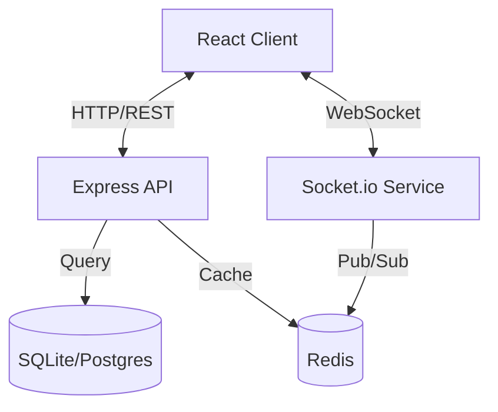

# DevInsight

**DevInsight** is a real-time developer collaboration platform designed to streamline code sharing, pair programming, and skill assessment. It features a modern, responsive interface and robust backend to support seamless developer interactions.

##  Features

-   ** Real-time Collaboration**: Code continuously with other developers using a synchronized editor (Monaco Editor + Socket.io).
-   ** Code Snippets**: Create, manage, and share reusable code snippets with syntax highlighting.
-   ** Coding Challenges**: Participate in algorithmic challenges.
-   ** High Performance**: Built with a scalable architecture using Redis for caching and session management.

##  Tech Stack

### Frontend
-   **Framework**: React 18, TypeScript, Create React App
-   **State Management**: Redux Toolkit
-   **Styling**: Tailwind CSS
-   **Editor**: Monaco Editor
-   **Real-time**: Socket.io Client

### Backend
-   **Runtime**: Node.js
-   **Framework**: Express.js
-   **Database**: SQLite (Development) / PostgreSQL (Production) - Managed via Prisma ORM
-   **Caching**: Redis
-   **Real-time**: Socket.io Server
-   **Authentication**: JWT & Cookies

##  Architecture



## Screenshots

| Login Page | Dashboard |
|:---:|:---:|
|  |  |

| Challenges List | Challenge Detail |
|:---:|:---:|
|  |  |

##  Getting Started

### Prerequisites
-   **Node.js** (v18+)
-   **npm**
-   **Redis** (Required for caching/sessions. Ensure a Redis instance is running locally on port 6379, or update `.env`)

### Installation

1.  **Clone the repository**
    ```bash
    git clone https://github.com/yourusername/devinsight.git
    cd devinsight
    ```

2.  **Backend Setup**
    ```bash
    cd backend
    
    # Install dependencies
    npm install
    
    # Configure Environment
    cp .env.example .env
    # NOTE: The default .env is configured for SQLite. 
    # If using Postgres, update DATABASE_URL and ensure schema.prisma provider is "postgresql".
    
    # Initialize Database (SQLite by default)
    npx prisma migrate dev
    
    # Seed Database (Optional)
    npm run seed
    
    # Start the Server
    npm run dev
    ```

3.  **Frontend Setup**
    ```bash
    cd frontend
    
    # Install dependencies
    npm install
    
    # Start the React App
    npm start
    ```

4.  **Visit the App**
    Open `http://localhost:3000` to view the application.

### Running Tests

To run the backend integration tests:

```bash
cd backend
npm test
```

###  Docker Support

The project includes a `docker-compose.yml` for orchestrating the full stack (Frontend, Backend, Postgres, Redis).

```bash
docker-compose up --build
```

