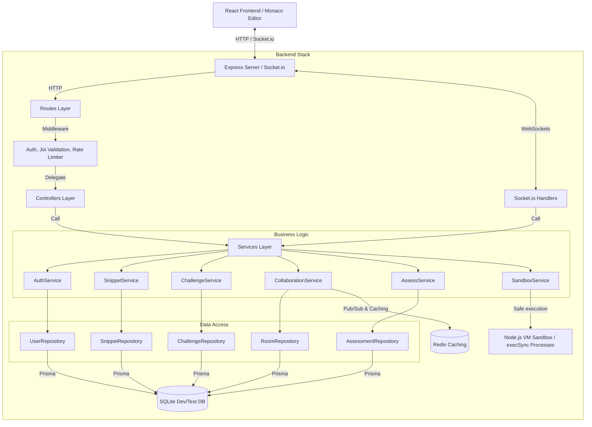

# DevInsight

**DevInsight** is a real-time developer collaboration platform built for code sharing, pair programming, and automated technical assessments. It provides a polished developer environment with synchronized editing, video calling, and sandboxed code execution.

---

## 🏗️ Architecture

DevInsight is structured around a decoupled **Repository ➔ Service ➔ Controller** architecture to maintain clean separation of concerns, strict type-safety, and database portability.


```mermaid
graph TD
    Client[React Frontend / Monaco Editor] <-->|HTTP / Socket.io| Server[Express Server / Socket.io]
    
    subgraph Backend [Backend Stack]
        Server -->|HTTP| Router[Routes Layer]
        Server <-->|WebSockets| Sockets[Socket.io Handlers]
        
        Router -->|Middleware| MW[Auth, Joi Validation, Rate Limiter]
        MW -->|Delegate| Ctrl[Controllers Layer]
        
        Ctrl -->|Call| Serv[Services Layer]
        Sockets -->|Call| Serv
        
        subgraph Services [Business Logic]
            Serv --> AuthService
            Serv --> SnippetService
            Serv --> ChallengeService
            Serv --> CollaborationService
            Serv --> AssessService
            Serv --> SandboxService
        end
        
        subgraph Repositories [Data Access]
            AuthService --> UserRepository
            SnippetService --> SnippetRepository
            ChallengeService --> ChallengeRepository
            CollaborationService --> RoomRepository
            AssessService --> AssessmentRepository
        end
        
        SandboxService -->|Safe execution| SafeVM[Node.js VM Sandbox / execSync Processes]
        
        UserRepository -->|Prisma| SQLite[(SQLite Dev/Test DB)]
        SnippetRepository -->|Prisma| SQLite
        ChallengeRepository -->|Prisma| SQLite
        RoomRepository -->|Prisma| SQLite
        AssessmentRepository -->|Prisma| SQLite
        
        CollaborationService -->|Pub/Sub & Caching| Redis[(Redis Caching)]
    end
```

### Key Architectural Layers:
1. **Controllers**: Purely HTTP mapping layers. They extract parameters, delegate to services, and format standardized responses.
2. **Services**: Contain all domain business logic (e.g. grading tests, sandboxing code, managing socket sessions).
3. **Repositories**: Abstracts database access using Prisma Client. Extends a generic `BaseRepository` providing unified CRUD behaviors.
4. **Sandbox / VM**: Separated context executing untrusted Javascript, TypeScript, Python, and Java code safely.

---

## ⚡ Key Features

*   **Real-time Collaboration**: Synchronized document editing via Socket.io and CRDTs (Y.js integration) with multi-cursor position indicators.
*   **WebRTC Video Bubbles**: Floating video overlay for live pair-programming calls within the workspace.
*   **Sandboxed Code Execution**: Custom-built VM engine evaluating user submissions against dynamic test cases across Javascript, Typescript, Python, and Java.
*   **Custom Assessment Engine**: Custom dashboard for technical interviews, allowing creators to prepare timed quizzes and challenges.
*   **Cache-Aside Caching**: High-performance optimization using Redis caching for high-read dashboards and leaderboards.
*   **SQLite Compatibility**: Local development and testing are fully independent and run entirely on SQLite.

---

## 🛠️ Tech Stack

*   **Frontend**: React 18, TypeScript, Redux Toolkit, Monaco Editor, Tailwind CSS, Socket.io Client.
*   **Backend**: Node.js, Express, TypeScript, Prisma ORM, Socket.io Server, Redis.
*   **Database**: SQLite for development and testing, with a model schema fully optimized to serialize complex JSON arrays/objects safely.

---

## 🚀 Getting Started

### Prerequisites
*   **Node.js** (v18+)
*   **Redis** (Optional. Automatically falls back to an in-memory mock if `REDIS_URL` is unset)

---

### Backend Setup

1.  **Navigate to the backend directory**:
    ```bash
    cd backend
    ```

2.  **Install dependencies**:
    ```bash
    npm install
    ```

3.  **Configure environment**:
    Create `.env` based on `.env.example`:
    ```bash
    cp .env.example .env
    ```
    *The backend defaults to using SQLite (`dev.db` file) for developer ease.*

4.  **Initialize the Database**:
    Sync the SQLite schema:
    ```bash
    npx prisma db push
    ```

5.  **Seed the Database**:
    Add sample coding challenges and user data:
    ```bash
    npm run seed
    ```

6.  **Run Development Server**:
    ```bash
    npm run dev
    ```

---

### Frontend Setup

1.  **Navigate to the frontend directory**:
    ```bash
    cd ../frontend
    ```

2.  **Install dependencies**:
    ```bash
    npm install
    ```

3.  **Run React app**:
    ```bash
    npm start
    ```
    *The application will open on `http://localhost:3000`.*

---

## 🧪 Running Tests

A complete suite of unit and integration tests is included.

```bash
cd backend
npm test
```

*   **Integration tests** (`tests/integration/`) evaluate full HTTP flows and Auth cookies.
*   **Unit tests** (`tests/unit/`) validate Services, Repositories, and the AppError boundary.

---

## 🐳 Docker Support

To start the entire application stack including real Redis and Postgres instances:

```bash
docker compose up --build
```
